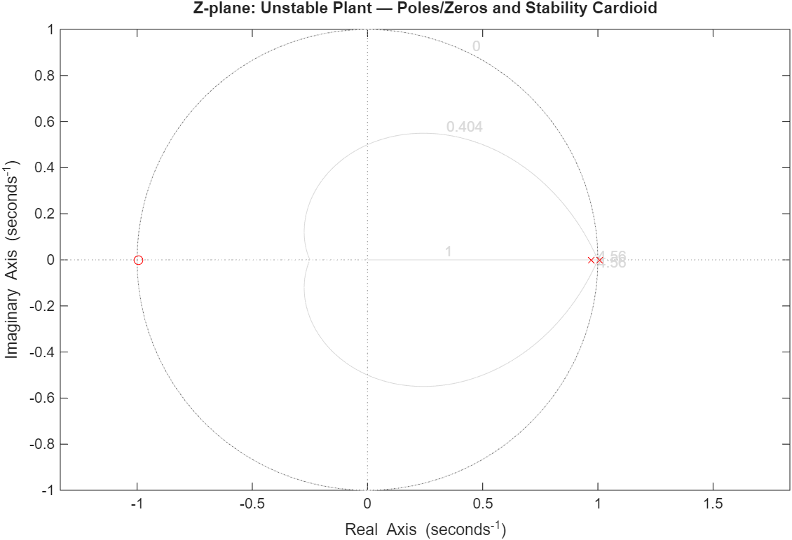
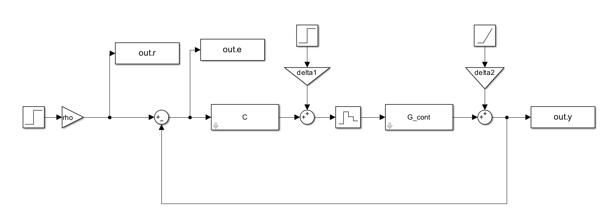
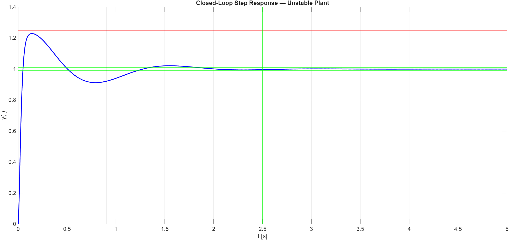

# Algebraic Design of 1-DOF Digital Controllers

This module covers the analysis and design of discrete-time 1-DOF feedback control systems. Starting from closed-loop stability and response analysis, it progresses to the full algebraic design of digital controllers via the Diophantine equation and the Sylvester matrix, addressing increasingly complex scenarios including plant pole cancellations, steady-state constraints, and unstable plants.

## Theoretical Overview

The core design methodology solves the **Diophantine equation**:

$$A_{dioph}(z) \cdot R(z) + B_{dioph}(z) \cdot S(z) = A_m(z)$$

where $A_m(z)$ is the desired closed-loop characteristic polynomial. The solution is found by constructing the **Sylvester matrix** $M_S$ and solving the linear system $M_S \cdot \theta = \Gamma$.

Key design decisions at each step:
1. **Steady-state requirements** → controller type $\ell_2$ (number of integrators in $C(z)$)
2. **Transient requirements** → $\zeta$, $\omega_n$ → dominant poles in the s-plane → mapped to z-plane via $z = e^{sT_s}$
3. **z-plane analysis** (pzmap + cardioid overlay) → factorization $A = A^+ \cdot A^-$, $B = B^+ \cdot B^-$
4. **Diophantine equation** → $R(z)$, $S(z)$ → controller $C(z) = \frac{A^+(z) S'(z)}{R(z)}$

---

## 1. Closed-Loop 1-DOF Analysis

Stability, tracking error response, and steady-state analysis of a discrete-time feedback loop in the presence of reference signals and input/output disturbances.

* **Internal stability:** closed-loop pole magnitudes, absence of unstable hidden modes.
* **Tracking error:** partial fraction expansion of $E(z)$ for manual z-antitransformation.
* **Steady-state:** Final Value Theorem applied to the total output under step reference and disturbances.

---

## 2. Algebraic Controller Design

Six progressive design scenarios, each building on the previous.

**Basic pole placement** — no cancellations, integral action embedded in $R(z)$ via a forced pole at $z = 1$.

**Design with pole cancellation** — z-plane analysis identifies which plant poles lie inside the stability cardioid and can be cancelled. Cancelled poles reappear as zeros of $S(z)$, reducing the Diophantine equation order.

**Over-constrained design** — when the number of unknowns exceeds the polynomial equations, an additional algebraic constraint row is added to the Sylvester matrix to recover a unique solution.

**Complete design from a continuous plant** — full workflow from $G(s)$ to $C(z)$: ZOH discretization, transient spec mapping, z-plane cardioid analysis, and steady-state constraint.

**Ramp disturbance rejection** — steady-state requirements under a ramp disturbance force a double integrator in the loop, requiring a higher-order Sylvester matrix.

**Design for an unstable plant** — the most complete scenario: unstable continuous plant, full transient and steady-state specs, Simulink validation.

### Z-plane Analysis (Section 6)

### Simulink Scheme

### Closed-Loop Step Response (Unstable Plant)

---

## Execution Requirements

* **Environment:** MATLAB
* **Dependencies:** Control System Toolbox, Optimization Toolbox.
* **Simulink** (required for Section 6 validation only): `AlgebraicDesign_UnstablePlant_sim.slx`
* **Usage:** Each section is self-contained. Run them sequentially or independently — every section begins with `clear all`.

| Script | Description |
|---|---|
| `ClosedLoop_1DOF_Analysis.m` | Stability, error response, and steady-state analysis |
| `AlgebraicDesign_PolePlacement.m` | Controller design via Diophantine equation (6 scenarios) |
