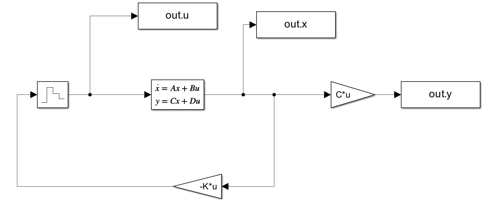
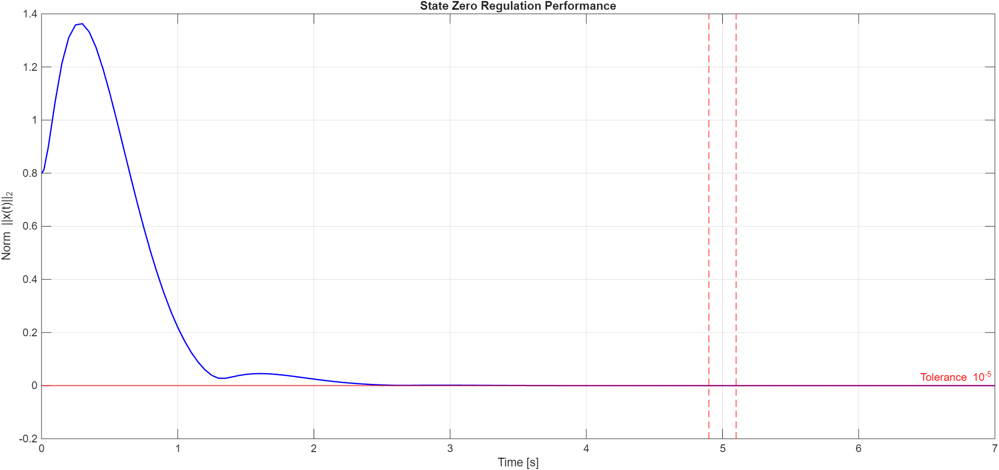
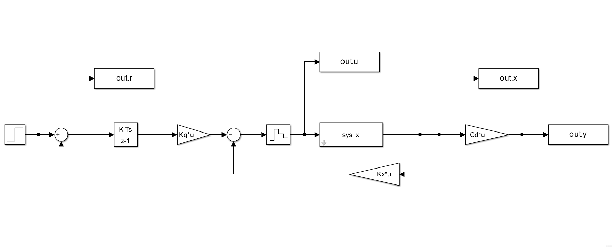
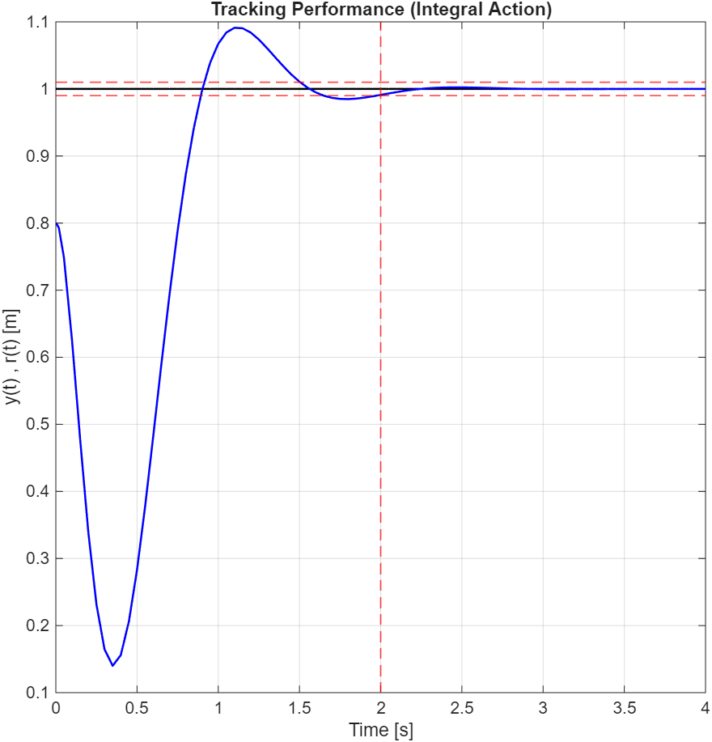

# Fundamentals of Digital LQR and Integral Tracking

This module demonstrates the foundational principles of discrete-time Linear Quadratic Regulation (LQR) applied to a continuous-time LTI mass-damper system. The objective is to design optimal digital controllers that balance state regulation accuracy with control effort optimization.

## 1. Zero Regulation (Standard LQR)

The first implementation focuses on driving the system state (position and velocity) to the origin from an initial non-zero displacement. 

* **Discretization:** The continuous-time plant is discretized using a Zero-Order Hold (ZOH) equivalent to accurately model the digital-to-analog conversion process.
* **Optimization:** The state penalty matrix `Q` is heavily weighted towards the position error to enforce a strict settling time constraint (zero regulation within ~5 seconds).
* **Simulink Implementation:** The plant model is configured to output the full state vector, allowing the static feedback gain `K` (computed via the Discrete Algebraic Riccati Equation) to close the loop.

### Control Scheme

### Performance (Zero Regulation)

---

## 2. Setpoint Tracking with Integral Action

Standard LQR acts as a virtual spring pulling the state towards zero. Consequently, it cannot track non-zero constant references without steady-state error. 

To solve this, an **Integral Action** is introduced by augmenting the system state with the discrete time integral of the tracking error ($e = r - y$).
* **Augmented Dynamics:** The controller computes an optimal gain matrix $K_{aug} = [K_q, K_x]$, where $K_q$ acts on the integrated error and $K_x$ acts on the physical states.
* **The Tracking Paradox & Hard Constraints:** While the integral action successfully achieves zero steady-state error, aggressive tuning (to reach a ~2s settling time) causes the requested control effort to severely violate the physical limits of the actuator ($|u| \le 1$). 

### Control Scheme

### Performance & Saturation Analysis

---

### The Bridge to Advanced Control
This module highlights the fundamental limitation of standard unconstrained LQR: it operates on "soft constraints" (weights in the cost function) but remains blind to absolute physical limits ("hard constraints"). Respecting actuator limits using LQR requires manual detuning, which sacrifices speed and performance. 

This observation serves as the theoretical motivation for moving toward **Constrained Optimization and Receding Horizon control** in the subsequent modules of this repository.

## Repository Structure

* `lqr_zero_regulation.m`: Discretization, reachability/observability checks, and DARE optimization for zero regulation.
* `LAB04_Ex1.slx`: Simulink model executing the zero regulation closed-loop simulation.
* `lqr_integral_tracking.m`: Augmented state space formulation for constant reference tracking and actuator demand analysis.
* `LAB04_Ex2.slx`: Simulink model executing the integral tracking control loop.