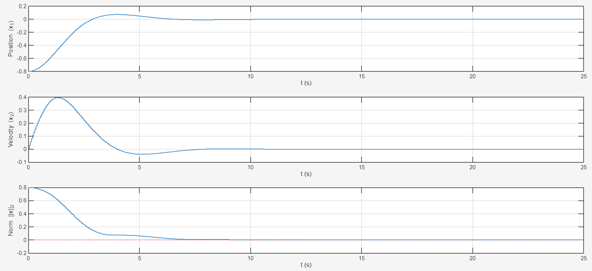
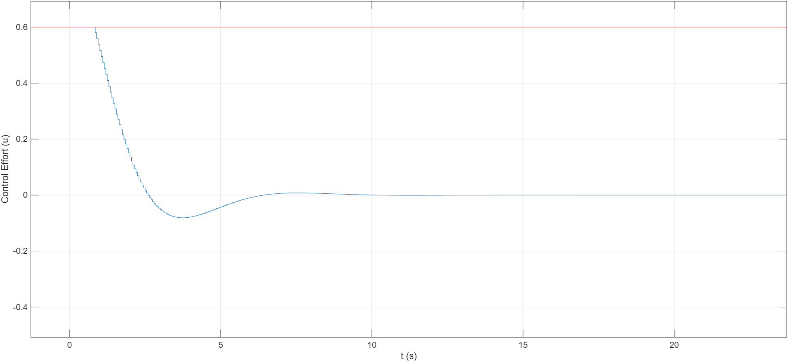
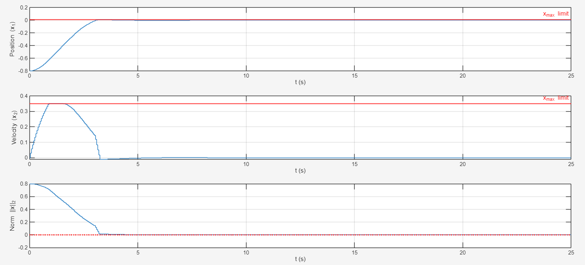
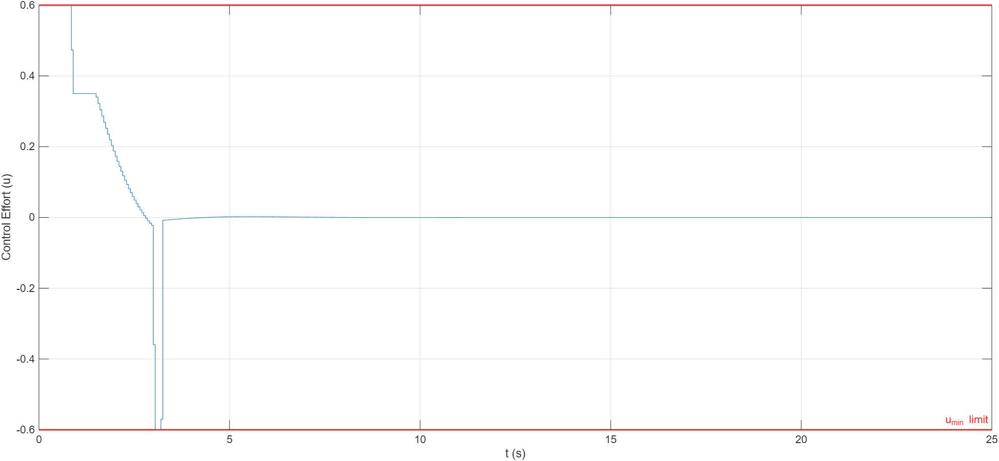

# Linear Quadratic Regulation & Receding Horizon Control

This module explores the design and implementation of discrete-time optimal controllers, progressing from standard unconstrained finite-horizon Linear Quadratic Regulation (LQR) to Receding Horizon control with strict physical constraints. The implementations serve as the mathematical foundation for Model Predictive Control (MPC) architectures.

## Theoretical Overview

The core objective is to compute an optimal control sequence $U(k)$ that minimizes a quadratic cost function over a defined prediction horizon ($H_p$), balancing state regulation accuracy and control effort (energy).

1. **Finite Horizon LQR:** Formulates the optimal control problem by predicting future states using autonomous evolution matrices and input mapping matrices.
2. **Constrained Optimization:** Integrates real-world physical limitations (e.g., actuator saturation limits, maximum spatial boundaries) into the optimization problem. The unconstrained analytical solution is replaced by Quadratic Programming (`quadprog`) to handle linear inequality constraints ($G \cdot U \le h$).
3. **Receding Horizon Principle:** Closes the control loop. While the optimizer calculates an $H_p$-step control sequence, only the first control action is applied to the physical plant. The state is then measured, the horizon shifts forward, and the optimization is recalculated, providing robustness against disturbances and model inaccuracies.

---

## 1. Static Constrained Optimization
The foundational scripts build the prediction matrices (`A_cal`, `B_cal`) and format the quadratic cost function.
* `unconstrained_finite_horizon.m`: Calculates the exact mathematical minimum without physical boundaries using the Hessian derivative.
* `constrained_finite_horizon.m`: Introduces static actuator constraints (input saturation). Utilizes MATLAB's `quadprog` to find the optimal control sequence that strictly respects physical limits.

---

## 2. Receding Horizon with Input Constraints
This implementation closes the loop on a 2D dynamic system. The algorithm plans 3 steps ahead while strictly respecting the actuator saturation ($|u| \le 0.6$), but applies only the first move before measuring the new state.

### State Evolution

### Actuator Demand (Saturated)

---

## 3. Receding Horizon with Full Constraints (Dynamic)
The most advanced implementation. It handles both static input constraints and **dynamic state constraints**. The script dynamically recalculates the remaining space to the state boundaries ($x_{max}$) relative to the autonomous evolution of the system at each time step.

### State Evolution (Constrained)

### Actuator Demand

---

## Execution Requirements

* **Environment:** MATLAB
* **Dependencies:** Optimization Toolbox (required for the `quadprog` solver).
* **Usage:** Each script is entirely self-contained. Run any `.m` file directly to execute the optimization, simulate the discrete-time system, and generate the corresponding trajectory plots.