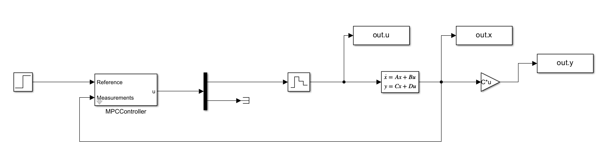
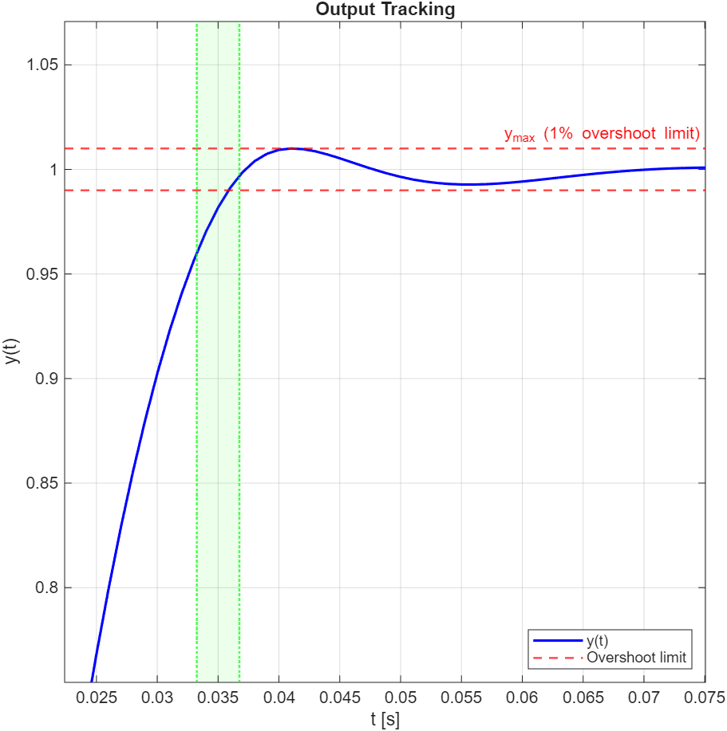
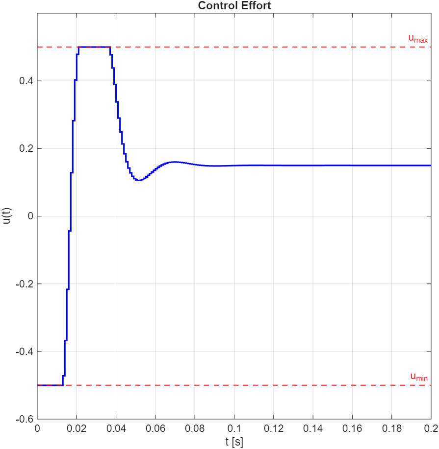
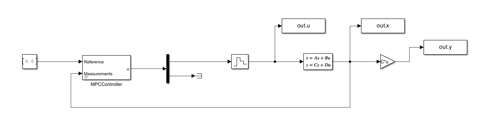
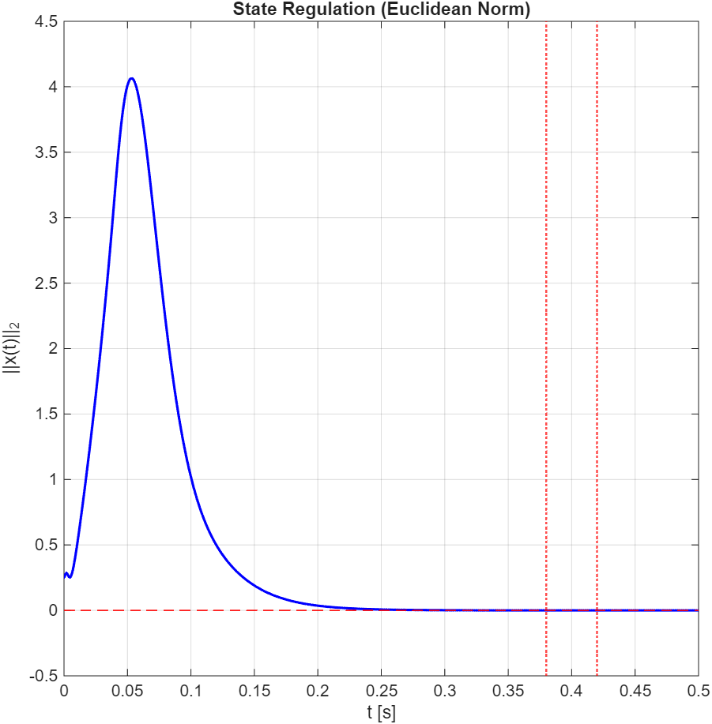
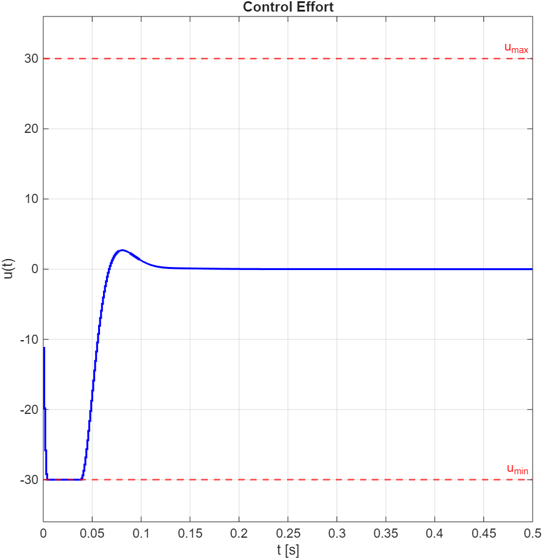

# Model Predictive Control (MPC)

This module implements closed-loop MPC controllers using the MPCtools toolbox, applied to an open-loop unstable second-order system with poles at s = ±30. The implementations demonstrate how constrained Quadratic Programming enables a controller to simultaneously stabilize an unstable plant, enforce hard physical limits, and optimize a quadratic cost function in real time.

## Theoretical Overview

At each sampling instant, MPC solves a finite-horizon constrained optimization problem. The controller predicts the system's future behavior over a prediction horizon $H_p$, computes the optimal control sequence minimizing a quadratic cost function, applies only the first action to the plant, and repeats at the next step — the **Receding Horizon Principle**.

The key advantage over standard LQR is the ability to enforce **hard constraints** on inputs and outputs directly within the optimization, rather than relying on cost function tuning alone.

**Horizon selection and stability:** For open-loop unstable plants, $H_p$ must be long enough to capture the diverging dynamics. Dropping below a critical threshold renders the QP problem infeasible and the controller fails.

---

## 1. Constrained Output Tracking

MPC controller designed to track a unit step reference, subject to a hard ceiling on the output (1% maximum overshoot) and actuator saturation (|u| ≤ 0.5).

### Simulink Scheme

### Output Response

### Control Effort

**Result:** The controller stabilizes the plant and strictly enforces both constraints. The settling time target (0.035 s) is not achieved — with |u| ≤ 0.5, the actuator lacks the authority to drive the output faster. This is the physically optimal outcome under the given constraints.

---

## 2. Full State Regulation

MPC controller designed to drive the full state vector $x = [x_1, x_2]^T$ back to the origin from an initial perturbation ($x_0 = [-0.25,\ 0]$). Both states are independently penalized and constrained.

### Simulink Scheme

### State Norm

### Control Effort

**Result:** The asymmetric cost matrix $Q = \text{diag}([1700,\ 1])$ heavily penalizes the position error $x_1$, allowing the controller to meet the 0.4 s settling time requirement within the ±30 actuator limits.

---

## Execution Requirements

* **Environment:** MATLAB + Simulink
* **Dependencies:** MPCtools toolbox, Optimization Toolbox (required for the internal `quadprog` solver).
* **Usage:** Each `.m` script is self-contained. Before running, ensure the corresponding Simulink model is in the MATLAB path.

| Script | Simulink Model |
|---|---|
| `MPC_ConstrainedOutputTracking.m` | `MPC_scheme_OutputTracking.slx` |
| `MPC_FullStateRegulation.m` | `MPC_scheme_StateRegulation.slx` |
